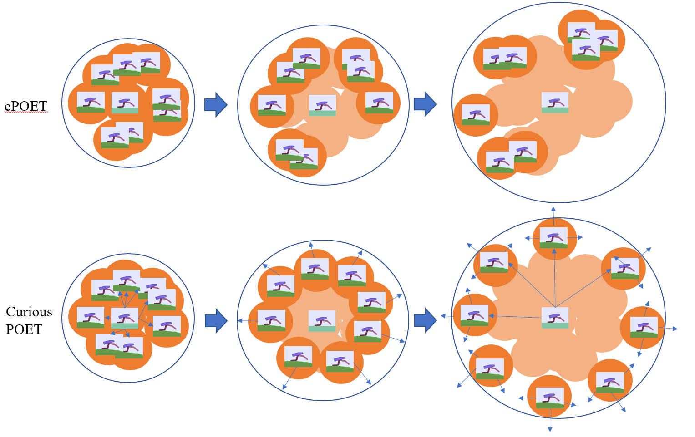
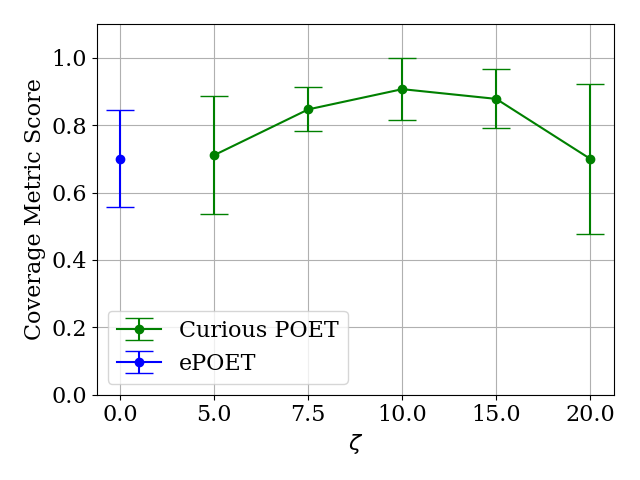
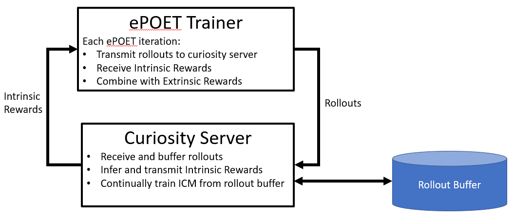

# Curious POET 

Curious POET augments [POET](https://arxiv.org/abs/1901.01753)/[ePOET](https://arxiv.org/abs/2003.08536)/[Marco Polo](https://github.com/act3-ace/marcopolo) with intrinsic motivation.  A centralized [curiosity module](http://proceedings.mlr.press/v70/pathak17a/pathak17a.pdf) provides intrinsic rewards to evolving POET agents that, in combination with extrinsic rewards from the bipedal walker environment, essentially speeds up evolution by directly rewarding behavioral diversity.  The effect of which is an increase in the efficiency of behavioral exploration.  

### Coverage Metric Score vs Instrinsic Motivation Coefficient \zeta



## Curious Poet Compute Architecture

Curious POET is set up to leverage two compute nodes with a shared file system and network subnet.  One is for POET training (Curious POET) and one for ICM training (Curious Oracle).   The Curious POET node should be cpu heavy, ideally 96 cores and 400GB ram.  (Adjust `num_workers` in `test_params_large_icm.yml` to match the number of cores.)  The Curious Oracle node should have a GPU, 4 cpu cores and perhaps 50GB ram.

## Quick Start:
On each node, build the appropriate environment and launch:

Curious Oracle (GPU) node:
```
./setup/oracle_startup.sh        # install requirements
conda env create -f setup/oracle_environment.yml
conda activate oracle
./run_train_icm.sh test
```
Curious POET trainer node:
```
./setup/cpoet_startup.sh        # install requirements
conda env create -f setup/cpoet_environment.yml
conda activate cpoet
./run_poet_local_large_icm.sh . test
```

### Notes
Change run name by replacing `test` above.  
To resume a run from checkpoint: `./resume_poet.sh . test cp-32`

In order to avoid catastrophic forgetting, the Curious Oracle stores and continuously trains on ALL rollouts.  Consequently, a 2000 iteration run tends to accumulate ~2TB of rollouts stored in hdf5 files.
